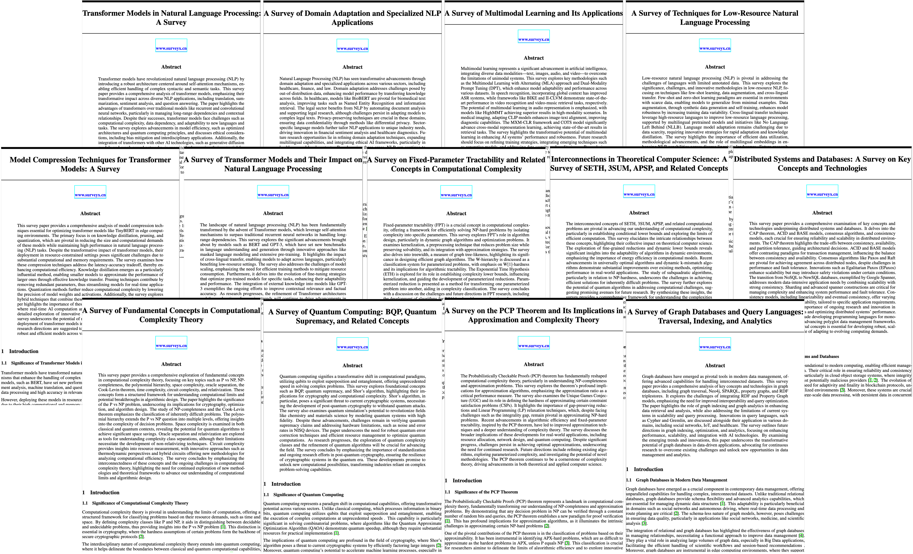

<h2 align="center">SurveyX: Academic Survey Automation via Large Language Models</h2>

<p align="center">
  <i>
✨Welcome to SurveyX! This GitHub repository serves as a channel for users to submit requests for paper generation based on specific topics or domains.📚
  </i>
  <br>
  <a href="https://arxiv.org/abs/2502.14776">
      
  </a>
  <a href="http://www.surveyx.cn">
    
  </a>
  <a href="https://huggingface.co/papers/2502.14776">
    
  </a>
</p>

<mark><strong>🚀 We're actively developing a full-featured product with a sleek graphical interface!</strong></mark>

<mark>⭐ Star this repo to stay updated and be the first to know about our progress and release announcements!</mark>

<mark>💡 Your support means everything to us as we work to bring this innovative solution to life. Stay tuned for more updates!</mark>

## ⭐Star History

[](https://star-history.com/#IAAR-Shanghai/SurveyX&Timeline)

## 🤔What is SurveyX?


**SurveyX** is an advanced academic survey automation system that leverages the power of Large Language Models (LLMs) to generate high-quality, domain-specific academic papers and surveys.🚀

By simply providing a **paper title** and **keywords** for literature retrieval, users can request comprehensive academic papers or surveys tailored to specific topics.

If you're curious about how SurveyX works or want to understand the underlying technology and methodology, feel free to check out our 📑[website](http://www.surveyx.cn), where we provide an in-depth explanation of the system's architecture, data processing methods, and experimental results.

## 🤔 What’s This Git For?

This GitHub repository is **designed to provide a platform where users can request the generation** of high-quality, domain-specific academic surveys by simply submitting an issue. The main purpose of this repository is to allow users to easily create and receive tailored academic surveys or papers, which are generated using SurveyX📄

By submitting an issue with a paper title and keywords for literature search, users can quickly generate a comprehensive review paper or survey on a specific topic. This process streamlines academic research by automating paper creation, saving users time and effort in compiling research content. 📚💡

## 🖋️How to Request a Custom Paper via Issue

To request a paper, create a new issue with the following details:

- **Paper Title**: Provide the title of the paper you need.
- **Keywords for Literature Search**: Provide keywords separated by commas that will help retrieve relevant literature and guide the content generation (e.g. "AI in healthcare, climate change impact on agriculture, ethical implications of AI").
- **Your email**(optional): Please provide your email address so that we can notify you promptly once the paper is ready. 

### 💬Example Issue Submission:

> **Title**: Controllable text generation of LLM: A Survey
>
> **Keywords**: AI, healthcare, ethical implications, technology adoption, AI-driven diagnostics
>
> **Email**: xxxxxxxx@SurveyX.cn

Once your request is submitted, the generated paper will be placed in the **user requests** folder. Please allow 1-2 business days for processing and generation. ⏳

## 📝Generated Topics



### Examples Papers

| Title                                                        | Keywords                                                     |
| ------------------------------------------------------------ | ------------------------------------------------------------ |
| [From BERT to GPT-4: A Survey of Architectural Innovations in Pre-trained Language Models](./examples/Computation_and_Language/Transformer.pdf) | Transformer, BERT, GPT-3, self-attention, masked language modeling, cross-lingual transfer, model scaling |
| [Unsupervised Cross-Lingual Word Embedding Alignment: Techniques and Applications](./examples/Computation_and_Language/low.pdf) | low-resource NLP, few-shot learning, data augmentation, unsupervised alignment, synthetic corpora, NLLB, zero-shot transfer |
| [Vision-Language Pre-training: Architectures, Benchmarks, and Emerging Trends](./examples/Computation_and_Language/multimodal.pdf) | multimodal learning, CLIP, Whisper, cross-modal retrieval, modality fusion, video-language models, contrastive learning |
| [Efficient NLP at Scale: A Review of Model Compression Techniques](./examples/Computation_and_Language/model.pdf) | model compression, knowledge distillation, pruning, quantization, TinyBERT, edge computing, latency-accuracy tradeoff |
| [Domain-Specific NLP: Adapting Models for Healthcare, Law, and Finance](./examples/Computation_and_Language/domain.pdf) | domain adaptation, BioBERT, legal NLP, clinical text analysis, privacy-preserving NLP, terminology extraction, few-shot domain transfer |
| [Attention Heads of Large Language Models: A Survey](./examples/Computation_and_Language/attn.pdf) | attention head, attention mechanism, large language model, LLM,transformer architecture, neural networks, natural language processing |
| [Controllable Text Generation for Large Language Models: A Survey](./examples/Computation_and_Language/ctg.pdf) | controlled text generation, text generation, large language model, LLM,natural language processing |
| [A survey on evaluation of large language models](./examples/Computation_and_Language/eval.pdf) | evaluation of large language models,large language models assessment, natural language processing, AI model evaluation |
| [Large language models for generative information extraction: a survey](./examples/Computation_and_Language/infor.pdf) | information extraction, large language models, LLM,natural language processing, generative AI, text mining |
| [Internal consistency and self feedback of LLM](./examples/Computation_and_Language/inter.pdf) | Internal consistency, self feedback, large language model, LLM,natural language processing, model evaluation, AI reliability |
| [Review of Multi Agent Offline Reinforcement Learning](./examples/Computation_and_Language/multi-agent.pdf) | multi agent, offline policy, reinforcement learning,decentralized learning, cooperative agents, policy optimization |
| [Reasoning of large language model: A survey](./examples/Computation_and_Language/reason.pdf) | reasoning of large language models, large language models, LLM,natural language processing, AI reasoning, transformer models |
| [Hierarchy Theorems in Computational Complexity: From Time-Space Tradeoffs to Oracle Separations](examples/Computational_Complexity/P_vs_.pdf) | P vs NP, NP-completeness, polynomial hierarchy, space complexity, oracle separation, Cook-Levin theorem |
| [Classical Simulation of Quantum Circuits: Complexity Barriers and Implications](examples/Computational_Complexity/BQP.pdf) | BQP, quantum supremacy, Shor's algorithm, post-quantum cryptography, QMA, hidden subgroup problem |
| [Kernelization: Theory, Techniques, and Limits](examples/Computational_Complexity/fixed.pdf) | fixed-parameter tractable (FPT), kernelization, treewidth, W-hierarchy, ETH (Exponential Time Hypothesis), parameterized reduction |
| [Optimal Inapproximability Thresholds for Combinatorial Optimization Problems](examples/Computational_Complexity/PCP.pdf) | PCP theorem, approximation ratio, Unique Games Conjecture, APX-hardness, gap-preserving reduction, LP relaxation |
| [Hardness in P: When Polynomial Time is Not Enough](examples/Computational_Complexity/SETH.pdf) | SETH (Strong Exponential Time Hypothesis), 3SUM conjecture, all-pairs shortest paths (APSP), orthogonal vectors problem, fine-grained reduction, dynamic lower bounds |
| [Consistency Models in Distributed Databases: From ACID to NewSQL](examples/Database/CAP.pdf) | CAP theorem, ACID vs BASE, Paxos/Raft, Spanner, NewSQL, sharding, linearizability |
| [Cloud-Native Databases: Architectures, Challenges, and Future Directions](examples/Database/CAP.pdf) | cloud databases, AWS Aurora, Snowflake, storage-compute separation, auto-scaling, pay-per-query, multi-tenancy |
| [Graph Database Systems: Storage Engines and Query Optimization Techniques](examples/Database/graph.pdf) | graph traversal, Neo4j, SPARQL, property graph, subgraph matching, RDF triplestore, Gremlin |
| [Real-Time Aggregation in TSDBs: Techniques for High-Cardinality Data](examples/Database/time.pdf) | time-series data, InfluxDB, Prometheus, downsampling, time windowing, high-cardinality indexing, stream processing |
| [Self-Driving Databases: A Survey of AI-Powered Autonomous Management](examples/Database/auto.pdf) | autonomous databases, learned indexes, query optimization, Oracle AutoML, workload forecasting, anomaly detection |
| [Multi-Model Databases: Integrating Relational, Document, and Graph Paradigms](examples/Database/mmd.pdf) | multi-model database, MongoDB, ArangoDB, JSONB, unified query language, schema flexibility, polystore |
| [Vector Databases for AI: Efficient Similarity Search and Retrieval-Augmented Generation](examples/Networking_and_Internet_Architecture/vector.pdf) | vector database, FAISS, Milvus, ANN search, embedding indexing, RAG (Retrieval-Augmented Generation), HNSW |
| [Software-Defined Networking: Evolution, Challenges, and Future Scalability](examples/Networking_and_Internet_Architecture/open.pdf) | OpenFlow, control plane/data plane separation, NFV orchestration, network slicing, P4 language, OpenDaylight, scalability bottlenecks |
| [Beyond 5G: Architectural Innovations for Terahertz Communication and Network Slicing](examples/Networking_and_Internet_Architecture/network.pdf) | network slicing, MEC (Multi-access Edge Computing), beamforming, mmWave, URLLC (Ultra-Reliable Low-Latency Communication), O-RAN, energy efficiency |
| [IoT Network Protocols: A Comparative Study of LoRaWAN, NB-IoT, and Thread](examples/Networking_and_Internet_Architecture/LPWAN.pdf) | LPWAN, LoRa, ZigBee 3.0, 6LoWPAN, TDMA scheduling, RPL routing, device density management |
| [Edge Caching in Content Delivery Networks: Algorithms and Economic Incentives](examples/Networking_and_Internet_Architecture/CDN.pdf) | CDN, Akamai, cache replacement policies, DASH (Dynamic Adaptive Streaming), QoE optimization, edge server placement, bandwidth cost reduction |
| [A survey on  flow batteries](examples/Other/battery.pdf)    | battery electrolyte formulation                              |
| [Research on battery electrolyte formulation](examples/Other/flow_battery.pdf) | flow batteries                                               |

### User Requested Papers

| Title                                                        | Keywords                                                     |
| ------------------------------------------------------------ | ------------------------------------------------------------ |
 | [Think and Draw! A survey on Vision-MLLMs that can understand and generate](user_requests/Think_and_Draw!_A_survey_on_Vision-MLLMs_that_can_understand_and_generate.pdf) | vision-language models, multimodal learning, generative AI |
 | [A Survey of new intent detection and discovery for Conversational Understanding](user_requests/A_Survey_of_new_intent_detection_and_discovery_for_Conversational_Understanding.pdf) | Out-of-domain Detection， New Intent Discovery， Generalized Category Discovery |
 | [A Survey of Segment Anything Model (SAM) in Medical Imaging: Advances in Vision Foundation Models](user_requests/A_Survey_of_Segment_Anything_Model_(SAM)_in_Medical_Imaging__Advances_in_Vision_Foundation_Models.pdf) | Segment Anything Model (SAM), Medical Image Segmentation, Vision Foundation Models, Prompt Engineering, Efficient Fine-Tuning |
 | [A Survey of joint extraction of medical entities and relations](user_requests/A_Survey_of_joint_extraction_of_medical_entities_and_relations.pdf) | Medical Entity Recognition, Joint Extraction, Relation Extraction, Biomedical Text Mining, Deep Learning |
 | [Reinforcement Learning for Large Language Models: Methods, Challenges, and Applications](user_requests/Reinforcement_Learning_for_Large_Language_Models__Methods,_Challenges,_and_Applications.pdf) | Large Language Models, Reinforcement Learning, RLHF, Reward Modeling, AI Alignment, Fine-Tuning, Prompt Optimization, Self-Supervised Learning, Model-based RL, Meta-Reinforcement Learning, AI Agents, Multi-Agent Reinforcement Learning (MARL), Curriculum Learning, Few-Shot Learning, Continual Learning, Adaptive Learning, Human-in-the-Loop Learning |
 | [Process Reward Models for LLM Reasoning](user_requests/Process_Reward_Models_for_LLM_Reasoning.pdf) | Process Reward Model, Reasoning, Large Language Model |
 | [Novel Multiferroics coupling ferroelectricity with Skyrmion, altermagnetism or Ferrovalley](user_requests/Novel_Multiferroics_coupling_ferroelectricity_with_Skyrmion,_altermagnetism_or_Ferrovalley.pdf) | Multiferroic, Skyrmion, altermagnetism, Ferrovalley, ferroelectricity |
 | [Comparative study of cardiac markers CKMB and LDH in pericardial fluid for postmortem diagnosis](user_requests/Comparative_study_of_cardiac_markers_CKMB_and_LDH_in_pericardial_fluid_for_postmortem_diagnosis.pdf) | Forensic medicine, Postmortem diagnosis, Sample timing, Cardiac muscle fibers, Myocardial infarction |
 | [A Multi-dimensional Perspective on Hybrid Human-Artificial Intelligence: Opportunities and Challenges in the Era of Large Language Models](user_requests/A_Multi-dimensional_Perspective_on_Hybrid_Human-Artificial_Intelligence__Opportunities_and_Challenges_in_the_Era_of_Large_Language_Models.pdf) | Hybrid Human-Artificial Intelligence, Large Language Models, Deep Learning, Reinforcement learning |
 | [Multimodal fusion with Multimodal Temporal Data for Clinical prediction](user_requests/Multimodal_fusion_with_Multimodal_Temporal_Data_for_Clinical_prediction.pdf) | Multimodal temporal data, Deep learning in healthcare, Clinical decision support systems (CDSS), Temporal alignment, Uncertainty quantification, Reinforcement learning in medicine, Medical image sequence analysis, Interpretable machine learning |
 | [A Survey on Unit Test Case Generation](user_requests/A_Survey_on_Unit_Test_Case_Generation.pdf) | Unit Test, Unit Testing, Large Language Model |
 | [Enhancing Blind Image Deblurring Robustness Against Saturated Images](user_requests/Enhancing_Blind_Image_Deblurring_Robustness_Against_Saturated_Images.pdf) | Blind Deblurring, Impulse Noise Detection, Non-convex Optimization, Saturated Images |
 | [A Comprehensive Survey of Token Compression for Vision Transformers, Vision Generation, Large Language Models, Large Multimodal Models](user_requests/A_Comprehensive_Survey_of_Token_Compression_for_Vision_Transformers,_Vision_Generation,_Large_Language_Models,_Large_Multimodal_Models.pdf) | Token Compression, Token Pruning, Token Reduction, Token Merging, Accelerating Diffusion Transformers, Vision-Language Models, Image Generation, Video Generation, Vision Transformers. Large Language Models, Acceleration, Efficient Large Multimodal Models |
 | [Automatic Detection of Age-Related Macular Degeneration in Mice Using OCT Images and Deep Neural Networks](user_requests/Automatic_Detection_of_Age-Related_Macular_Degeneration_in_Mice_Using_OCT_Images_and_Deep_Neural_Networks.pdf) | Age-Related Macular Degeneration (AMD), Optical Coherence Tomography (OCT), Convolutional Neural Networks (CNN), VGG16, ResNet, Deep Learning,nnUNet, Biomedical Image Analysis, Classification Models, Artificial Intelligence in Ophthalmology |
 | [Deep learning for depression recognition with multimodal : A Review](user_requests/Deep_learning_for_depression_recognition_with_multimodal___A_Review.pdf) | Depression, Multimodal methods, Emotion recognition, Deep learning, Unimodal methods, Psychological abnormalities |
 | [Paper on the PET image reconstruction, focused on the methods in the generation AI era, comparing deterministic and generative methods ](user_requests/Paper_on_the_PET_image_reconstruction,_focused_on_the_methods_in_the_generation_AI_era,_comparing_deterministic_and_generative_methods_.pdf) | AI, medical imaging, PET, reconstruction, generative model |
 | [LLM-based Autonomous Agents Empowered Social Sciences: From a Social Simulation Perspective](user_requests/LLM-based_Autonomous_Agents_Empowered_Social_Sciences__From_a_Social_Simulation_Perspective.pdf) | large language models, LLM-based agent, social simulation, social science, social intelligence, world simulation |
 | [Multi-modal Knowledge Graph Completion and Its Application: A Comprehensive Survey](user_requests/Multi-modal_Knowledge_Graph_Completion_and_Its_Application__A_Comprehensive_Survey.pdf) | Knowledge Graphs, Multi-modal Knowledge Graph Completion, Multi-modal Fusion, Knowledge Graph Application, Link Prediction |
 | [A Fingerprint Localization Algorithm Based on Low-Density Tags](user_requests/A_Fingerprint_Localization_Algorithm_Based_on_Low-Density_Tags.pdf) | Indoor location, Fingerprint location |
 | [Document Understanding with Multi-modal Large Language Model : A Survey](user_requests/Document_Understanding_with_Multi-modal_Large_Language_Model___A_Survey.pdf) | Document Understanding, Multi-modal Large Language, Document AI, Document VQA |
 | [Towards human-like multimodal perception and cognition: A review of challenges and future prospects of MLLM multimodal alignment.](user_requests/Towards_human-like_multimodal_perception_and_cognition__A_review_of_challenges_and_future_prospects_of_MLLM_multimodal_alignment..pdf) | nan |
 | [Temporal Question Answering: A survey](user_requests/Temporal_Question_Answering__A_survey.pdf) | Large Language Models, Temproal Knowledge Graph, Retrieval-Augmented Generation |
 | [Automated Material Synthesis Laboratory: A Survey](user_requests/Automated_Material_Synthesis_Laboratory__A_Survey.pdf) | Robotics, AI, LLM, Autonomous laboratory, Active learning, Machine learning, Deep learning, High-throughput, DFT, Materials science, Chemistry |
 | [Emergent Abilities in Large Language Models: a Survey](user_requests/Emergent_Abilities_in_Large_Language_Models__a_Survey.pdf) | Large Language Models, Emergent Abilities |
 | [A Comprehensive Survey of Text-to-Speech Synthesis: Technologies, Methodologies, and Applications](user_requests/A_Comprehensive_Survey_of_Text-to-Speech_Synthesis__Technologies,_Methodologies,_and_Applications.pdf) | Text-to-speech (TTS) systems, speech synthesis architectures, parametric TTS, neural TTS, deep learning for speech synthesis, waveform generation, vocoders, prosody modeling, multilingual speech synthesis, real-time TTS, voice conversion, zero-shot TTS, evaluation metrics for TTS |
 | [From Signal to Parameter: A Complete Technical Guide to All PPG-Derived Measurements and Their Extraction Methods](user_requests/From_Signal_to_Parameter__A_Complete_Technical_Guide_to_All_PPG-Derived_Measurements_and_Their_Extraction_Methods.pdf) | Photoplethysmography, Biosensors, Signal processing, Optical monitoring, Vital signs, Biomedical engineering |
 | [The Potential and Challenges of Artificial Intelligence in Policing : A survey](user_requests/The_Potential_and_Challenges_of_Artificial_Intelligence_in_Policing___A_survey.pdf) | AI, Policing, Law enforcement, Crime prevention, Surveillance, Predictive analytics, Ethics, Bias, Decision-making, Legal implications |
 | [Application of multi-modal large-scale model in robot orientation](user_requests/Application_of_multi-modal_large-scale_model_in_robot_orientation.pdf) | Multi-modal large model, robot, Reinforcement learning, embodied intelligence,Hybrid model of experts |
 | [Application Research on fatigue detection using face recognition technology](user_requests/Application_Research_on_fatigue_detection_using_face_recognition_technology.pdf) | Fatigue detection, face recognition, deep learning image processing |
 | [Deep Learning Applications in Single-cell Omics for Colorectal Cancer Research](user_requests/Deep_Learning_Applications_in_Single-cell_Omics_for_Colorectal_Cancer_Research.pdf) | Deep Learning, Single-cell Omics, Colorectal Cancer, Bioinformatics |
 | [Prediction of shear strength parameters of granite residual soil based on machine learning](user_requests/Prediction_of_shear_strength_parameters_of_granite_residual_soil_based_on_machine_learning.pdf) | granite residual soil, machine learning, shear strength parameters, data processing, model interpretability |
 | [Quantifying the Use and Impact of Machine Learning in Lung Sound Classification and Recognition](user_requests/Quantifying_the_Use_and_Impact_of_Machine_Learning_in_Lung_Sound_Classification_and_Recognition.pdf) | Machine learning, lung sounds, respiratory sound recognition, Pulmonary sound analysis,Feature extraction |
 | [Process Reward Models for Large Language Model Reasoning: A Comprehensive Review](user_requests/Process_Reward_Models_for_Large_Language_Model_Reasoning__A_Comprehensive_Review.pdf) | Large Language Models, process supervision, step-level supervision, process reward model (PRM), step-level reward, process verifier, step-by-step verifier, Reinforcement Learning |
 | [A Comprehensive Survey of Low-Rank Adaptation (LoRA) in Large Language Models, Vision Generation, Large Multimodal Models and Beyond: Methods, Theories, Applications and Opportunities](user_requests/A_Comprehensive_Survey_of_Low-Rank_Adaptation_(LoRA)_in_Large_Language_Models,_Vision_Generation,_Large_Multimodal_Models_and_Beyond__Methods,_Theories,_Applications_and_Opportunities.pdf) | LoRA (Low-Rank Adaptation), LoRA Hyperparameters, LoRA with Pruning, Multimodal learning, Vision-Language Models |
 | [Symbolic Regression: Architectures, Benchmarks, and Emerging Trends](user_requests/Symbolic_Regression__Architectures,_Benchmarks,_and_Emerging_Trends.pdf) | symbolic regression, sparse regression, equation discovery, genetic algorithms, Reinforcement Learning, large language models |
 | [EEG Foundation Model: A Survey](user_requests/EEG_Foundation_Model__A_Survey.pdf) | AI, EEG, Foundation model, Deep Learning, Time Series, BCI |
 | [PCB defect detection: a survey](user_requests/PCB_defect_detection__a_survey.pdf) | PCB defect detection |
 | [Diffusion Models in object detection: A  survey.](user_requests/Diffusion_Models_in_object_detection__A__survey..pdf) | Diffusion Models, object detection, object recognition |
 | [The Impact of AI Image Recognition Technology in Sports Fitness Training on Customer Participation and Repurchase Intention: A Survey](user_requests/The_Impact_of_AI_Image_Recognition_Technology_in_Sports_Fitness_Training_on_Customer_Participation_and_Repurchase_Intention__A_Survey.pdf) | Image Recognition, Sports Fitness Training, Customer Participation, Repurchase Intention |
 | [A review on AGI-enabled solutions for IoX services exploding with cyber-physical-social-thinking space](user_requests/A_review_on_AGI-enabled_solutions_for_IoX_services_exploding_with_cyber-physical-social-thinking_space.pdf) | services exploding, AI, internet of things, internet of people, Internet of Thinking |
 | [A review of deep-learning-based approaches for Positron Emission Tomography Reconstrution](user_requests/A_review_of_deep-learning-based_approaches_for_Positron_Emission_Tomography_Reconstrution.pdf) | deep learning, Positron Emission Tomography, PET image reconstrution |
 | [Finetuning Mixture of Experts LLMs: Methods, Applications, Risks and Opportunities](user_requests/Finetuning_Mixture_of_Experts_LLMs__Methods,_Applications,_Risks_and_Opportunities.pdf) | LLMs, Large Language Models, Mixture of Experts, training, Continued Pretraining, Finetuning, SFT, Supervised Finetuning, MOE, Expert router, LORA, PEFT, Full Finetuning, retraining experts, finetuning experts |
 | [A Survey on Large Language Model based Autonomous Agents](user_requests/A_Survey_on_Large_Language_Model_based_Autonomous_Agents.pdf) | Autonomous agent, Large language model, Human-level intelligence, AGI, ASI, coding |
 | [Progress and Prospects of Research on the Whole Stage of Coal Spontaneous Combustion](user_requests/Progress_and_Prospects_of_Research_on_the_Whole_Stage_of_Coal_Spontaneous_Combustion.pdf) | spontaneous combustion, comprehensive prevention and control throughout all stages, machine learning, artificial intelligence, informatization, monitoring and early warning, fire prevention and control, emergency rescue |
 | [a survey on large language model for debugging the programs](user_requests/a_survey_on_large_language_model_for_debugging_the_programs.pdf) | Autonomous agent, Large language model, Debug, Debug like a Human, Human in the loop, Human-Computer Interaction, Automatic Program Repair, self-debug, testing |
 | [Deepfake Detection Guided by data augmentation: A Survey](user_requests/Deepfake_Detection_Guided_by_data_augmentation__A_Survey.pdf) | deepfake, data augmentation, inverse graphics, classifier, computer vision, faceswap |
 | [A Comprehensive Survey of Facial Landmark Detection](user_requests/A_Comprehensive_Survey_of_Facial_Landmark_Detection.pdf) | facial landmark detection, face alignment, 3d facial landmarks, face morphing, facial retouching, virtual makeup |
 | [Tree Crown Delineation in Remote Sensing: A Review](user_requests/Tree_Crown_Delineation_in_Remote_Sensing__A_Review.pdf) | Individual tree crown delineation, Tree crown detection, LiDAR, RGB high-resolution imagery, UAV remote sensing, very high-resolution , multispectral, deep learning, tropical forest, ecology, remote sensing, aerial imagery, automatic tree crown delineation |
 | [A Comprehensive Survey on LLM-Post-Training-oriented Data Synthesis](user_requests/A_Comprehensive_Survey_on_LLM-Post-Training-oriented_Data_Synthesis.pdf) | - |
 | [Using Large Language Model Agents in psychology](user_requests/Using_Large_Language_Model_Agents_in_psychology.pdf) | Large Language Model, LLM Agents, psychology |


## 📃Citing SurveyX

Please cite us if you find this project helpful for your project/paper:

```plain text
@misc{liang2025surveyxacademicsurveyautomation,
      title={SurveyX: Academic Survey Automation via Large Language Models}, 
      author={Xun Liang and Jiawei Yang and Yezhaohui Wang and Chen Tang and Zifan Zheng and Simin Niu and Shichao Song and Hanyu Wang and Bo Tang and Feiyu Xiong and Keming Mao and Zhiyu li},
      year={2025},
      eprint={2502.14776},
      archivePrefix={arXiv},
      primaryClass={cs.CL},
      url={https://arxiv.org/abs/2502.14776}, 
}
```

<hr style="border: 1px solid #ecf0f1;">


## ⚠️ Note

- Our retrieval engine may not have access to many papers that require commercial licensing. If your research topic requires papers from sources other than arXiv, the quality and comprehensiveness of the generated papers may be affected due to limitations in our retrieval scope.
- We currently only support the generation of English academic survey generation. Support for other languages is not available.

## ⚠️Disclaimer

SurveyX uses advanced language models to assist with the generation of academic papers. However, it is important to note that the generated content is a tool for research assistance. Users should verify the accuracy of the generated papers, as SurveyX cannot guarantee full compliance with academic standards.

