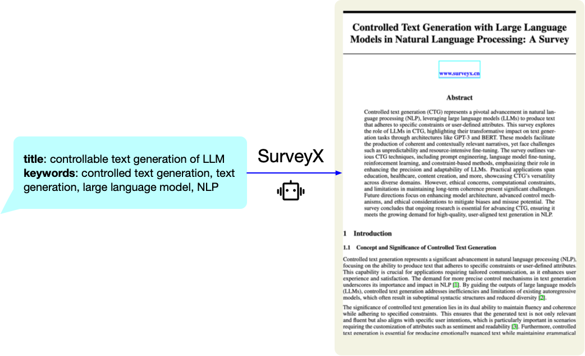

<h2 align="center">SurveyX: Academic Survey Automation via Large Language Models</h2>

  <i>
✨Welcome to SurveyX! This GitHub repository serves as a channel for users to submit requests for paper generation based on specific topics or domains.📚
  </i>

## 🤔What is SurveyX?

**SurveyX** is an advanced academic survey automation system that leverages the power of Large Language Models (LLMs) to generate high-quality, domain-specific academic papers and surveys.🚀

By simply providing a **paper title** and **keywords** for literature retrieval, users can request comprehensive academic papers or surveys tailored to specific topics.

If you're curious about how SurveyX works or want to understand the underlying technology and methodology, feel free to check out our 📑[website](http://www.surveyx.cn), where we provide an in-depth explanation of the system's architecture, data processing methods, and experimental results.

## 🤔 What’s This Git For?

This GitHub repository is **designed to provide a platform where users can request the generation** of high-quality, domain-specific academic surveys by simply submitting an issue. The main purpose of this repository is to allow users to easily create and receive tailored academic surveys or papers, which are generated using SurveyX📄

By submitting an issue with a paper title and keywords for literature search, users can quickly generate a comprehensive review paper or survey on a specific topic. This process streamlines academic research by automating paper creation, saving users time and effort in compiling research content. 📚💡

## 🖋️How to Request a Custom Paper via Issue

To request a paper, create a new issue with the following details:

- **Paper Title**: Provide the title of the paper you need.
- **Keywords for Literature Search**: Provide keywords separated by commas that will help retrieve relevant literature and guide the content generation (e.g. "AI in healthcare, climate change impact on agriculture, ethical implications of AI").

### 💬Example Issue Submission:

> **Title**: Controllable text generation of LLM: A Survey
>
> **Keywords**: AI, healthcare, ethical implications, technology adoption, AI-driven diagnostics

Once your request is submitted, the generated paper will be placed in the **user requests** folder. Please allow 1-2 business days for processing and generation. ⏳

## 📝Generated Topics

| Title                                                        | Keywords                                                     |
| ------------------------------------------------------------ | ------------------------------------------------------------ |
| [From BERT to GPT-4: A Survey of Architectural Innovations in Pre-trained Language Models](./examples/Computation and Language/Transformer.pdf) | Transformer, BERT, GPT-3, self-attention, masked language modeling, cross-lingual transfer, model scaling |
| [Unsupervised Cross-Lingual Word Embedding Alignment: Techniques and Applications](./examples/Computation and Language/low.pdf) | low-resource NLP, few-shot learning, data augmentation, unsupervised alignment, synthetic corpora, NLLB, zero-shot transfer |
| [Vision-Language Pre-training: Architectures, Benchmarks, and Emerging Trends](./examples/Computation and Language/multimodal.pdf) | multimodal learning, CLIP, Whisper, cross-modal retrieval, modality fusion, video-language models, contrastive learning |
| [Efficient NLP at Scale: A Review of Model Compression Techniques](./examples/Computation and Language/model.pdf) | model compression, knowledge distillation, pruning, quantization, TinyBERT, edge computing, latency-accuracy tradeoff |
| [Domain-Specific NLP: Adapting Models for Healthcare, Law, and Finance](./examples/Computation and Language/domain.pdf) | domain adaptation, BioBERT, legal NLP, clinical text analysis, privacy-preserving NLP, terminology extraction, few-shot domain transfer |
| [Hierarchy Theorems in Computational Complexity: From Time-Space Tradeoffs to Oracle Separations](examples/Computational Complexity/P_vs_.pdf) | P vs NP, NP-completeness, polynomial hierarchy, space complexity, oracle separation, Cook-Levin theorem |
| [Classical Simulation of Quantum Circuits: Complexity Barriers and Implications](examples/Computational Complexity/P_vs_.pdf) | BQP, quantum supremacy, Shor's algorithm, post-quantum cryptography, QMA, hidden subgroup problem |
| [Kernelization: Theory, Techniques, and Limits](examples/Computational Complexity/fixed.pdf) | fixed-parameter tractable (FPT), kernelization, treewidth, W-hierarchy, ETH (Exponential Time Hypothesis), parameterized reduction |
| [Optimal Inapproximability Thresholds for Combinatorial Optimization Problems](examples/Computational Complexity/PCP.pdf) | PCP theorem, approximation ratio, Unique Games Conjecture, APX-hardness, gap-preserving reduction, LP relaxation |
| [Hardness in P: When Polynomial Time is Not Enough](examples/Computational Complexity/SETH.pdf) | SETH (Strong Exponential Time Hypothesis), 3SUM conjecture, all-pairs shortest paths (APSP), orthogonal vectors problem, fine-grained reduction, dynamic lower bounds |
| [Consistency Models in Distributed Databases: From ACID to NewSQL](examples/Database/CAP.pdf) | CAP theorem, ACID vs BASE, Paxos/Raft, Spanner, NewSQL, sharding, linearizability |
| [Cloud-Native Databases: Architectures, Challenges, and Future Directions](examples/Database/CAP.pdf) | cloud databases, AWS Aurora, Snowflake, storage-compute separation, auto-scaling, pay-per-query, multi-tenancy |
| [Graph Database Systems: Storage Engines and Query Optimization Techniques](examples/Database/CAP.pdf) | graph traversal, Neo4j, SPARQL, property graph, subgraph matching, RDF triplestore, Gremlin |
| [Real-Time Aggregation in TSDBs: Techniques for High-Cardinality Data](examples/Database/CAP.pdf) | time-series data, InfluxDB, Prometheus, downsampling, time windowing, high-cardinality indexing, stream processing |
| [Self-Driving Databases: A Survey of AI-Powered Autonomous Management](examples/Database/auto.pdf) | autonomous databases, learned indexes, query optimization, Oracle AutoML, workload forecasting, anomaly detection |
| [Multi-Model Databases: Integrating Relational, Document, and Graph Paradigms](examples/Database/mmd.pdf) | multi-model database, MongoDB, ArangoDB, JSONB, unified query language, schema flexibility, polystore |
| [Vector Databases for AI: Efficient Similarity Search and Retrieval-Augmented Generation](examples/Networking and Internet Architecture/CDN.pdf) | vector database, FAISS, Milvus, ANN search, embedding indexing, RAG (Retrieval-Augmented Generation), HNSW |
| [Software-Defined Networking: Evolution, Challenges, and Future Scalability](examples/Networking and Internet Architecture/CDN.pdf) | OpenFlow, control plane/data plane separation, NFV orchestration, network slicing, P4 language, OpenDaylight, scalability bottlenecks |
| [Beyond 5G: Architectural Innovations for Terahertz Communication and Network Slicing](examples/Networking and Internet Architecture/network.pdf) | network slicing, MEC (Multi-access Edge Computing), beamforming, mmWave, URLLC (Ultra-Reliable Low-Latency Communication), O-RAN, energy efficiency |
| [IoT Network Protocols: A Comparative Study of LoRaWAN, NB-IoT, and Thread](examples/Networking and Internet Architecture/LPWAN.pdf) | LPWAN, LoRa, ZigBee 3.0, 6LoWPAN, TDMA scheduling, RPL routing, device density management |
| [Edge Caching in Content Delivery Networks: Algorithms and Economic Incentives](examples/Networking and Internet Architecture/CDN.pdf) | CDN, Akamai, cache replacement policies, DASH (Dynamic Adaptive Streaming), QoE optimization, edge server placement, bandwidth cost reduction |

## ⚠️Disclaimer

SurveyX uses advanced language models to assist with the generation of academic papers. However, it is important to note that the generated content is a tool for research assistance. Users should verify the accuracy of the generated papers, as SurveyX cannot guarantee full compliance with academic standards.

